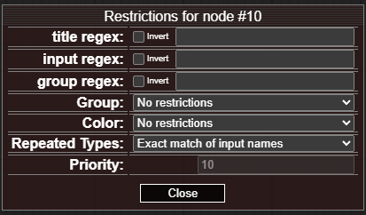

# UE Nodes

Love this node? [Buy me a coffee!](https://www.buymeacoffee.com/chrisgoringe)

Getting started? Download the test workflow below and see how it works.

Problems? Jump down to [logging and debugging](https://github.com/chrisgoringe/cg-use-everywhere/blob/main/README.md#loggingdebugging)

Ideas for how to improve the nodes (or bug reports) - [raise an issue](https://github.com/chrisgoringe/cg-use-everywhere/issues)

Shameless plug for another nodes -> Check out [Image Picker](https://github.com/chrisgoringe/cg-image-filter) for another way to make some workflows smoother. And leave a star if you like something!

---

# TL;DR

Here's the standard ComfyUI template modified to use `AnythingEverywhere`

|workflow|output image you can drop into Comfy|
|-|-|
|||

The `MODEL`, `CLIP`, and `VAE` are automatically broadcast to all the places they are needed.

Doesn't make much difference in this simple case, but with complex workflows it really does.
This is what the default wan 2.2 s2v video workflow looks like:

|before|after|
|-|-|
|||

---

# 7.x Updates

## 7.3

Bugfixes: 
[361](https://github.com/chrisgoringe/cg-use-everywhere/issues/361), 
[379](https://github.com/chrisgoringe/cg-use-everywhere/issues/379), 
[381](https://github.com/chrisgoringe/cg-use-everywhere/issues/381)

## 7.2.1 and 7.2.2

Bugfixes: 
[383](https://github.com/chrisgoringe/cg-use-everywhere/issues/383), 
[384](https://github.com/chrisgoringe/cg-use-everywhere/issues/384), 
[388](https://github.com/chrisgoringe/cg-use-everywhere/issues/388)

## 7.2

- Added support for [Combo inputs](#combo-clone) via the `Combo Clone` helper node
- Fixed a number of issues related to subgraphs
- Improved handling of disconnect
- Added new options for handling multiple inputs of same type
- Added internationalisation options

## 7.1

- Allowed individual inputs to block UE connections
- Added support for multiple inputs of the same type
- Fixed a number of minor subgraph issues
- Fixed a serious bug with UE on Safari [details](https://github.com/chrisgoringe/cg-use-everywhere/issues/359)

---

# Anything Everywhere v7

Version 7 is a major update to the Anything Everywhere nodes, so the documentation below is all new. If you are looking for the old docs, you can find them [here](https://github.com/chrisgoringe/cg-use-everywhere/README-old).

If you are new to Anything Everywhere, skip to [Anything Everywhere](#anything-everywhere).

## Major changes

If you used Anything Everywhere prior to v7, the major improvements are:

- The `Anything Everywhere3` and `Anything Everywhere?` nodes are deprecated, as their features are now part of the standard `Anything Everywhere` node.
- `Anything Everywhere` nodes now have dynamic inputs, so you can plug as many different things into them as you like.
- All the restrictions on what nodes data will be sent to are now in a restrictions editor, that can be accessed through the right click menu of the node, or by double-clicking the body of the node.
  - In the restrictions editor you can set title, input, and group regexes, color restrictions, group restrictions, and priority (for when two nodes both match)
  - The green circle is used to indicate that _any_ restrictions are in place; if you hover over a node with restrictions they will appear in a tooltip
- Subgraphs are supported (in the majority of cases). Yay subgraphs! Seriously, they are _so_ much better than group nodes.
  - There are lots of odd cases with subgraphs, so if you find a case not covered properly, please [raise an issue](https://github.com/chrisgoringe/cg-use-everywhere/issues)

There are a couple of features that have been removed:

- Group nodes are no longer supported, as they are deprecated in ComfyUI in favour of the new subgraphs, which are supported (in most configurations)
- The `Simple String` mechanism to provide an input to the regex of an `Anything Everywhere?` node is no longer supported
  - Other UI mechanisms to address this need are under consideration

## Upgrade considerations

Other than the limitations noted, old workflows _should_ load and work out of the box, 
with `Anything Everywhere3` and `Anything Everywhere?` nodes automatically converted to `Anything Everywhere` nodes with the appropriate restrictions applied.

However, there may be edge cases that don't work; if you have any problems, please [raise an issue](https://github.com/chrisgoringe/cg-use-everywhere/issues).

You will _not_ be able to use workflows saved using v7 with older versions of ComfyUI or older versions of UE.

**Group Nodes are no longer supported**

---

# Anything Everywhere

The `Anything Everywhere` node takes one or more inputs (currently limited to one input of any data type) and sends the data to other nodes that need it. 
When you connect an input, a new one automatically appears.

## Where will the data be sent?

By default the data will be sent to any input of the same data type which does not have a connection, and does not have a widget providing the value.

You can specify that an input should not accept data, or that one with a widget should, via the `UE Connectable Inputs` menu: 
the green bar indicates an input is connectable. The `Reject UE links` option can be used to make this node completely reject UE links, regardless of other settings.


The node also has visual indications: a black ring and a glow on the input dot indicates it is connectable. 
In the image below, `positive` has been set to not accept UE inputs, `steps` has been set to accept them, and `model` has a UE connection.


If a widget is getting data from a UE connection, it is grayed out, like `steps` below:


You can also constrain where the data gets send through  _restrictions_ applied to the `Anything Everywhere` node. 
These restrictions can be accessed by double-clicking the body of the node, or through the right-click menu.



The first three entries are [regex](https://regex101.com/) patterns. 
The node will only send data to another node if the regex matches the receiving node title, the name of the input, or the name of a group the receiving node is in, respectively.

The Group and Colour restrictions will constrain the node to only send to nodes in (or not in) the same group, and of the same (or different) colour.

If you select multiple restrictions, all must be satisfied for the node to send.

If any restrictions are applied, the `Anything Everywhere` node gets a green circle in the top left hand corner, and a tooltip if you hover the mouse over it (as long as Show Links is not set to None).

`Repeated Types` determines behaviour when more than one input of the same type is connected to an `Anything Everywhere` node.
In this case an additional constraint is used to disambiguate which inputs match 
by comparing the name of the input slot on the `Anything Everywhere` node with 
either the name of the input slot on the target node, or the name of the target node.
The `match start` and `match end` options require that the input names match from the start (or end) for the full length of the shorter: 
so you can match `seed` to `seed` or `noise_seed` by naming the `Anything Everywhere` input `seed` and selecting `Match end of input names`.

You can rename input slots by right-clicking on the input dot - but you can't rename widget inputs - this is a limitation imposed by ComfyUI ([discussion](https://github.com/Comfy-Org/ComfyUI_frontend/issues/3654)). The work-around is to rename the target node (or use multiple `Anything Everywhere` nodes with other constraints, especially color matching).

`String to Combos` (default `no`) can be used to allow a `STRING` input to be sent to a `COMBO` widget. Since there may be a lot of combo widgets, this should be used with care - you will almost certainly want to use other restrictions (such as an `input regex`, or the `Repeated Types` constraint withj multiple strings (eg `sampler_name` and `scheduler`)). *No validation takes place* to ensure that the string sent is one of the combo options!

## Resolving clashes

What if two or more `Anything Everywhere` nodes can send to the same input?

Each node has an automatically calculated priority - in general the more restrictive the node, the higher the priority.
You can see this prority in the restrictions dialog, and you can choose to replace the automatically calculated value if you wish.

If two more more `Anything Everywhere` nodes match the same input, the higher priority node is used. If there is a tie, _no connection is made_.
When there is a tie, if you right-click on the canvas you will find an option to show which nodes are the problem.

## Special Case Nodes

These two nodes might go away in the future; if they do, workflows using them will be automatically updated with their replacements...

## Seed Everywhere

Seed Everywhere connects to any unconnected INT input which matches the regex `seed|随机种` (basically all the default seed input names). 
It has the control_after_generate feature. So if you mark the seed widgets as allowing UE Connections, you can use the same seed everywhere.

## Prompts Everywhere

Prompt Everywhere has two inputs. They will be sent with regex matching rules designed to match `prompt` or `positive`, and `neg`, respectively.

The actual regexes used are `(_|\\b)pos(itive|_|\\b)|^prompt|正面` and `(_|\\b)neg(ative|_|\\b)|负面`

|strings|conditionings|
|-|-|
||

---

# Options

In the main settings menu, you will find the Use Everywhere options:


The top set, `Graphics`, modify the visual appearance only. 

The bottom set, `Options`, modify behaviour:

- When connecting, use the output slot's name as the input name. When a new connection is made to a UE node, the default is to name the input with the type. Select this option to use the output name of the node the link is from.
- Block workflow validation. This prevents other nodes from complaining about the lack of connections, or creating them. If you turn this off, there may be unexpected consequences.
- Logging. Increase the logging level if you are asked to help debug.
- Connect to bypassed nodes. When off, Use Everywhere will not connect to a bypassed node, and will attempt to work out whether an input is connected when upstream nodes are bypassed. I recommend turning this on.

---

# Primitives and COMBOs and the like


UE nodes work with the primitives added in more recent versions of Comfy (in the `primitive` submenu), 
but not the old-style `Primitive`, or reroute nodes.

It is very unlikely this will ever change, as it relates to some issues deep within Comfy.

As of version 7.2, Combo inputs are now supported via a new helper node, `Combo Clone`. 

## Combo Clone

For each Combo type you want to use, add a Combo Clone node. Here we want to be able to broadcast `sampler_name` and `scheduler`.


Connect the `Combo Clone` output to a widget you want it to replicate. The `Combo Clone` copies the options from that widget, and the widget name.


Disconnect the `Combo Clone` and  connect it to an `Anything Everywhere` node. The name copying means you can connect multiple Combos to a single `Anything Everywhere` node.


It can now broadcast to any node with the same input type (but remember you will have to mark the Combo widget as UE Connectable, since widgets are not connectable by default). 


---

# Other features

## Third Party Integration - the UE API

At the suggestion of [@fighting-tx](https://github.com/fighting-tx), 
I've added a method that third party nodes can use if they want to see the prompt as generated by UE. 
It's attached to the `app` object, so you can check if it is present and use it something like this:

```js
var prompt
if (app.ue_modified_prompt) {
  prompt = await app.ue_modified_prompt()
} else {
  prompt = await original_graphToPrompt.apply(app)
}
```

Other methods could be exposed if there is interest - raise an issue if you'd like to see something. 

## Show links - visualisation and animation.

If you want to see the UE links, you can turn them on and off by right-clicking on the canvas. For finer control, the main settings menu has options to show links when the mouse moves over the node at either end, or when one of those nodes is selected.

The links can be animated to distinguish them from normal links - this animation can take the form of moving dots, a pulsing glow, or both. This may impact performance in some cases - note that the pulse animation requires less processing than the moving dots. Control this in the main settings menu.

By default the animations turn off when the workflow is running to minimise impact on CPU/GPU - you can change this in the settings too.

## Convert to real links

If you want to share a workflow without UE nodes being required, or to save an API version of a workflow, you can replace the virtual links created by UE nodes with real links (and remove the UE nodes).

This can be done for a single node by right-clicking on it and selecting `Convert to real links`, or for all UE nodes in a graph or subgraph by right-clicking the background and selecting `Convert all UEs to real links`.

---

# Roadmap

In the near future I hope to do the following:

- Deprecate the `Seed Everywhere` node [385](https://github.com/chrisgoringe/cg-use-everywhere/issues/385)
- Deprecate the `Prompts Everywhere` node [386](https://github.com/chrisgoringe/cg-use-everywhere/issues/386)
- Negative regexes ('must not match') [335](https://github.com/chrisgoringe/cg-use-everywhere/issues/387)
- Add a global variable system (so multiple node regexes can be changed with a single modification) [387](https://github.com/chrisgoringe/cg-use-everywhere/issues/387)

Feel free to [make suggestions](https://github.com/chrisgoringe/cg-use-everywhere/issues)

---

# More detailed notes on a few things

## Subgraph creation

There are three nodes involved in every UE link: 
- Source (the link sending the data), 
- Control (the UE node connected to the source), 
- Target (the node that is receiving the data as an input)

This is how those cases are treated:

|Support|Source|Control|Target||
|-|-|-|-|-|
|Yes|Graph|Graph|Graph|Nothing changes|
|Yes|Graph|Graph|Subgraph|The subgraph will have inputs for the data; in the subgraph the input panel is connected to the Target with a real link|
|No|Graph|Subgraph|Graph|Not supported|
|No*|Graph|Subgraph|Subgraph|Not supported|
|Yes|Subgraph|Graph|Graph|The subgraph will be connected to the Control|
|No|Subgraph|Graph|Subgraph|Not supported|
|Yes|Subgraph|Subgraph|Graph|The Source will be connected to the Control *and* the output panel in the subgraph, the output will be connected to the Target with a real link|
|Yes|Subgraph|Subgraph|Subgraph|All nodes will be connected in the subgraph as they were in the graph|

No* indicates a case that does not work, but might get implemented.

No indicates a case I'm unlikely ever to support

---

# Reporting a bug well

If you are having problems, the better information you give me, the more chance I can fix it! 

Read the list below and include anything that seems relevant. If you can't get the information, that's ok, it just makes it less likely I'll be able to work out what's going on!

- **describe what you did, what you expected, and what happened**
- if you have a simple workflow that recreates the problem, that's a huge help
- Comfy version information (in Settings - About, it looks like this:)

- check your version of the node (look in the `Use Everywhere` settings)
- press f12 and see if there are any errors in the javascript console that look like they might be relevant
- look at the server (python) console log and see if there are any errors there

---

# Thanks to 

The following people have contributed code or helpful discussions, without which these nodes would be less good!

- [DrJKL](https://github.com/DrJKL)
- [fighting-tx](https://github.com/fighting-tx)
- [huchenlei](https://github.com/huchenlei)
- [fichas](https://github.com/fichas)
- [LukeG89](https://github.com/LukeG89)
- [set-soft](https://github.com/set-soft)
- [TinyTerra](https://github.com/TinyTerra)
- [bananasss00](https://github.com/bananasss00)
- [JorgeR81](https://github.com/JorgeR81)

Feel free to [make suggestions, or implement features](https://github.com/chrisgoringe/cg-use-everywhere/issues) to get your name added here!
